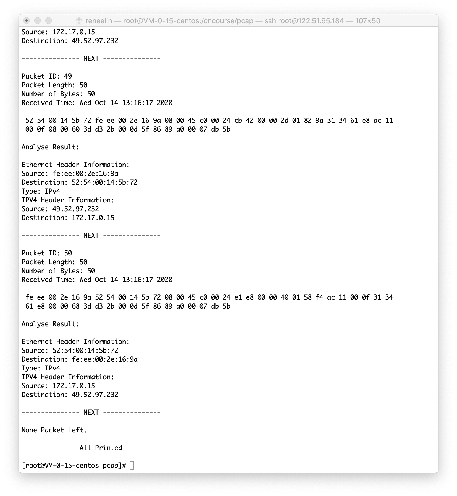
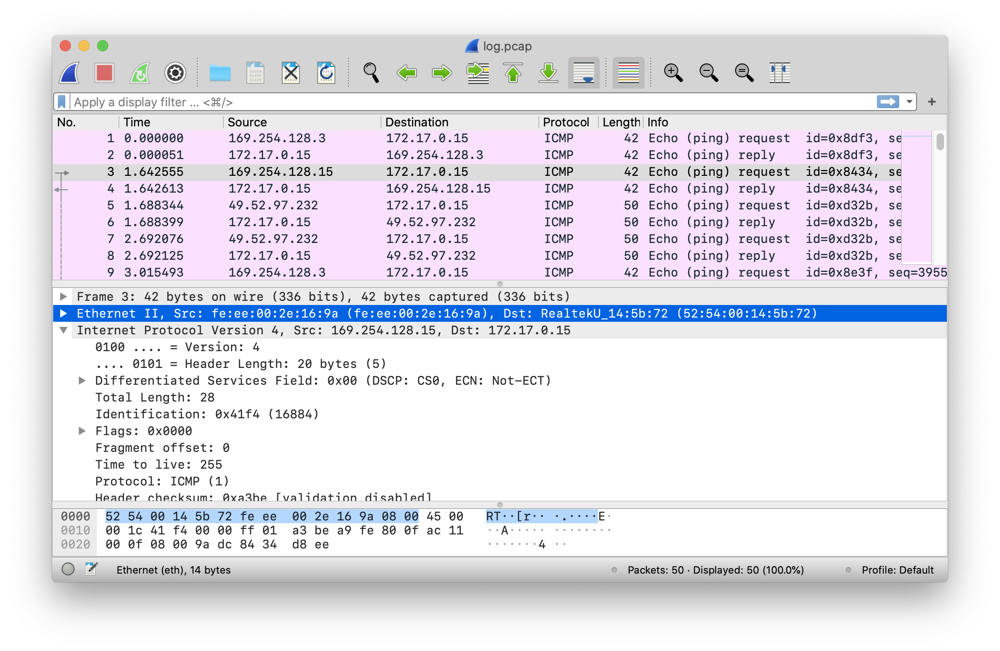

# CentOS 8下 基于C语言 使用libpcap 对IPv4抓包实现

**Created Date**: 2020-10-14 12:56:24
**Last Upgraded Date**: 2020-10-14 13:21:45

<br/>


# 操作环境

>自用腾讯云服务器
>
>CentOS Linux release 8.0.1905 (Core) 
>
>libpcap 1.9.1

# 准备工作

## 安装gcc后，安装flex、bison

```shell
[root@VM-0-15-centos /]# yum -y install flex
[root@VM-0-15-centos /]# yum -y install bison
```

## wget下载libpcap

```shell
[root@VM-0-15-centos /]# wget -c http://www.tcpdump.org/release/libpcap-1.9.1.tar.gz
```

## tar解压并安装

```shell
tar libpcap-1.9.1.tar.gz
cd libpcap-1.9.1
./configure
make
make install
```

# 代码构成

**COMPILE: gcc -o pcap pcap.c -lpcap**
**USAGE: ./pcap eth0 10**

由于linux服务器默认编码问题，因此代码内注释均为英语编写。

## Include necessary library

```c
#include <stdio.h>
#include <pcap.h>		// IMPORTANT
#include <time.h>
#include <netinet/in.h>
#include <arpa/inet.h>
#include <errno.h>
#include <string.h>
#include <stdlib.h>		// Use for atoi
```

## Define Header Struct

此部分按需添加。根据网络协议规定编写代码。

```c
typedef struct eth_hdr	// Ethernet Header
{
    u_char dst_mac[6];
    u_char src_mac[6];
    u_short eth_type;
}eth_hdr;
eth_hdr *ethernet;

typedef struct ip_hdr	// IPv4 Header
{
    int version:4;
    int header_len:4;
    u_char tos:8;
    int total_len:16;
    int ident:16;
    int flags:16;
    u_char ttl:8;
    u_char protocol:8;
    int checksum:16;
    u_char sourceIP[4];
    u_char destIP[4];
}ip_hdr;
ip_hdr *ip;
```

## Setting the device

也可以调用函数获取已连接的网络设备。

```c
		char *dev, errbuf[1024];

    // Choose network device
    dev = argv[1];
    if (dev == NULL) {
        printf("You didn't provide any NETWORK DEVICE.\n");
        return 0;
    }
    printf("Device: %s\n", dev);
```

## Opening the device for sniffing

### main Function

```c
		// Open network device
    pcap_t *pcap_handle = pcap_open_live(dev, 65535, 1, 0, errbuf);

    if (pcap_handle == NULL) {
        printf("%s\n", errbuf);
        return 0;
    }

		// Enter Loop and Open Dump
		printf("\n---------------The PACKET U Get--------------\n\n");
    int id = 0; // ID
    char *num = argv[2];
    // char *rule = argv[3];
    if (num == NULL) {
        printf("You didn't provide Packet number.\n");
        return 0;
    }
    int pnum = atoi(num);
    pcap_dumper_t* dumpfp = pcap_dump_open(pcap_handle, "./log.pcap");
    // Receive [pnum] packets
    if (pcap_loop(pcap_handle, pnum, pcap_callback, (unsigned char *)dumpfp) < 0){
        printf("error\n");
        return 0;
    }

    pcap_dump_close(dumpfp);
    pcap_close(pcap_handle);
    printf("None Packet Left.\n\n---------------All Printed--------------\n\n");
```

### Callback Function

```c
void pcap_callback(unsigned char * arg, const struct pcap_pkthdr *packet_header, const unsigned char *packet_content){
    static int id = 1;
    printf("Packet ID: %d\n", id++);
    pcap_dump(arg, packet_header, packet_content);
    printf("Packet Length: %d\n", packet_header->len);
    printf("Number of Bytes: %d\n", packet_header->caplen);
    printf("Received Time: %s\n", ctime((const time_t*)&packet_header->ts.tv_sec));
    int i;
    for (i = 0; i < packet_header->caplen; i++){
        printf(" %02x", packet_content[i]);
        if ((i + 1) % 32 == 0){
            printf("\n");
        }
    }
    printf("\n\n");

    u_int eth_len = sizeof(struct eth_hdr);
    u_int ip_len = sizeof(struct ip_hdr);
    u_int tcp_len = sizeof(struct tcp_hdr);
    u_int udp_len = sizeof(struct udp_hdr);

    printf("Analyse Result:\n\n");

    printf("Ethernet Header Information:\n");
    ethernet = (eth_hdr *)packet_content;
    printf("Source: %02x:%02x:%02x:%02x:%02x:%02x\n",ethernet->src_mac[0],ethernet->src_mac[1],ethernet->src_mac[2],ethernet->src_mac[3],ethernet->src_mac[4],ethernet->src_mac[5]);
    printf("Destination: %02x:%02x:%02x:%02x:%02x:%02x\n",ethernet->dst_mac[0],ethernet->dst_mac[1],ethernet->dst_mac[2],ethernet->dst_mac[3],ethernet->dst_mac[4],ethernet->dst_mac[5]);
    // printf("Type: %u\n",ethernet->eth_type);

    if(ntohs(ethernet->eth_type)==0x0800){
    	printf("Type: IPv4\n");
        // printf("IPV4 is used.\n");
        printf("IPV4 Header Information:\n");
        ip = (ip_hdr*)(packet_content+eth_len);
        printf("Source: %d.%d.%d.%d\n",ip->sourceIP[0],ip->sourceIP[1],ip->sourceIP[2],ip->sourceIP[3]);
        printf("Destination: %d.%d.%d.%d\n",ip->destIP[0],ip->destIP[1],ip->destIP[2],ip->destIP[3]);
    }
    else {
    	printf("Type: IPv6\n");
        // printf("IPV6 is used.\n");
    }

    printf("\n%s\n\n", "--------------- NEXT ---------------");
}
```

## BPF Filtering

此处的过滤规则为只抓取PING请求与响应。

```c
		// BPF Filter
    struct bpf_program filter;
    pcap_compile(pcap_handle, &filter, "icmp[icmptype] == icmp-echoreply or icmp[icmptype] == icmp-echo", 1, 0);
    pcap_setfilter(pcap_handle, &filter);
```

使用BPF过滤规则，你可以确定该获取和检查哪些流量，忽略哪些流量。BPF让你能够通过比较第2、3、4层协议中各个数据字段值的方法对流量进行过滤。BPF中内置了一些“基元”来指代一些常用的协议字段。可以用“host”、"prot"之类的基元写出非常简洁的BPF过滤规则，也可以检测位于指定偏移量上的字段（甚至可以是一个位）的值。BPF过滤器也可以由详尽的条件链和嵌套的逻辑“与”、“或”操作组成。

现在，构造一个BPF过滤器的最简单的办法就是使用BPF“基元”来指定协议、协议元素或者其他抓包规则。基元通常是由一个id(名称或序号)再加上一个或多个限定符组成的。

- type限定符：规定了id名或id序号指的是哪种类型的数据，可能的type有host、net、prot和protrange
- dir限定符：规定了流量是从id流进还是流出的（或两种兼有）。可能的dir有src、dst、ser or dst、src and dst、addr1、addr2、addr3和addr4
- Proto限定符：规定了所匹配的协议。可能的proto有：ether、fddi、tr、wlan、ip、ip6、arp、rarp、decnet、tcp和udp

## Save .pcap for Wireshark Analysis

* In main function

```c
		int pnum = atoi(num);
    pcap_dumper_t* dumpfp = pcap_dump_open(pcap_handle, "./log.pcap");
    if (pcap_loop(pcap_handle, pnum, pcap_callback, (unsigned char *)dumpfp) < 0){
        printf("error\n");
        return 0;
    }
    pcap_dump_close(dumpfp);
```

* In Callback Function

```c
    pcap_dump(arg, packet_header, packet_content);
```

## Whole pcap.c

```c
#include <stdio.h>
#include <pcap.h>		// IMPORTANT
#include <time.h>
#include <netinet/in.h>
#include <arpa/inet.h>
#include <errno.h>
#include <string.h>
#include <stdlib.h>		// Use for atoi

typedef struct eth_hdr	// Ethernet Header
{
    u_char dst_mac[6];
    u_char src_mac[6];
    u_short eth_type;
}eth_hdr;
eth_hdr *ethernet;

typedef struct ip_hdr	// IPv4 Header
{
    int version:4;
    int header_len:4;
    u_char tos:8;
    int total_len:16;
    int ident:16;
    int flags:16;
    u_char ttl:8;
    u_char protocol:8;
    int checksum:16;
    u_char sourceIP[4];
    u_char destIP[4];
}ip_hdr;
ip_hdr *ip;

typedef struct tcp_hdr	// TCP Header
{
    u_short sport;
    u_short dport;
    u_int seq;
    u_int ack;
    u_char head_len;
    u_char flags;
    u_short wind_size;
    u_short check_sum;
    u_short urg_ptr;
}tcp_hdr;
tcp_hdr *tcp;

typedef struct udp_hdr	// UDP Header
{
    u_short sport;
    u_short dport;
    u_short tot_len;
    u_short check_sum;
}udp_hdr;
udp_hdr *udp;


// Callback Function
void pcap_callback(unsigned char * arg, const struct pcap_pkthdr *packet_header, const unsigned char *packet_content){
    static int id = 1;
    printf("Packet ID: %d\n", id++);
    pcap_dump(arg, packet_header, packet_content);
    printf("Packet Length: %d\n", packet_header->len);
    printf("Number of Bytes: %d\n", packet_header->caplen);
    printf("Received Time: %s\n", ctime((const time_t*)&packet_header->ts.tv_sec));
    int i;
    for (i = 0; i < packet_header->caplen; i++){
        printf(" %02x", packet_content[i]);
        if ((i + 1) % 32 == 0){
            printf("\n");
        }
    }
    printf("\n\n");

    u_int eth_len = sizeof(struct eth_hdr);
    u_int ip_len = sizeof(struct ip_hdr);
    u_int tcp_len = sizeof(struct tcp_hdr);
    u_int udp_len = sizeof(struct udp_hdr);

    printf("Analyse Result:\n\n");

    printf("Ethernet Header Information:\n");
    ethernet = (eth_hdr *)packet_content;
    printf("Source: %02x:%02x:%02x:%02x:%02x:%02x\n",ethernet->src_mac[0],ethernet->src_mac[1],ethernet->src_mac[2],ethernet->src_mac[3],ethernet->src_mac[4],ethernet->src_mac[5]);
    printf("Destination: %02x:%02x:%02x:%02x:%02x:%02x\n",ethernet->dst_mac[0],ethernet->dst_mac[1],ethernet->dst_mac[2],ethernet->dst_mac[3],ethernet->dst_mac[4],ethernet->dst_mac[5]);
    // printf("Type: %u\n",ethernet->eth_type);

    if(ntohs(ethernet->eth_type)==0x0800){
    	printf("Type: IPv4\n");
        // printf("IPV4 is used.\n");
        printf("IPV4 Header Information:\n");
        ip = (ip_hdr*)(packet_content+eth_len);
        printf("Source: %d.%d.%d.%d\n",ip->sourceIP[0],ip->sourceIP[1],ip->sourceIP[2],ip->sourceIP[3]);
        printf("Destination: %d.%d.%d.%d\n",ip->destIP[0],ip->destIP[1],ip->destIP[2],ip->destIP[3]);
    }
    else {
    	printf("Type: IPv6\n");
        // printf("IPV6 is used.\n");
    }

    printf("\n%s\n\n", "--------------- NEXT ---------------");
}

int main(int argc, char *argv[])
{
    char *dev, errbuf[1024];

    // Choose network device
    dev = argv[1];
    if (dev == NULL) {
        printf("You didn't provide any NETWORK DEVICE.\n");
        return 0;
    }
    printf("Device: %s\n", dev);

    // Open network device
    pcap_t *pcap_handle = pcap_open_live(dev, 65535, 1, 0, errbuf);

    if (pcap_handle == NULL) {
        printf("%s\n", errbuf);
        return 0;
    }

    // Get IP Address and Netmask
    struct in_addr addr;
    bpf_u_int32 ipaddr, ipmask;
    char *dev_ip, *dev_mask;
    if (pcap_lookupnet(dev, &ipaddr, &ipmask,errbuf) == -1) {
        printf("%s\n", errbuf);
        return 0;
    }

    // Print IP Address
    addr.s_addr = ipaddr;
    dev_ip = inet_ntoa(addr);
    printf("IP Address : %s\n", dev_ip);

    // Print Netmask
    addr.s_addr = ipmask;
    dev_mask = inet_ntoa(addr);
    printf("Netmask : %s\n", dev_mask);

    // BPF Filter
    struct bpf_program filter;
    pcap_compile(pcap_handle, &filter, "icmp[icmptype] == icmp-echoreply or icmp[icmptype] == icmp-echo", 1, 0);
    pcap_setfilter(pcap_handle, &filter);

    // Enter Loop and Open Dump
    printf("\n---------------The PACKET U Get--------------\n\n");
    int id = 0; // ID
    char *num = argv[2];
    // char *rule = argv[3];
    if (num == NULL) {
        printf("You didn't provide Packet number.\n");
        return 0;
    }
    int pnum = atoi(num);
    pcap_dumper_t* dumpfp = pcap_dump_open(pcap_handle, "./log.pcap");
    // Receive [pnum] packets
    if (pcap_loop(pcap_handle, pnum, pcap_callback, (unsigned char *)dumpfp) < 0){
        printf("error\n");
        return 0;
    }

    pcap_dump_close(dumpfp);

    pcap_close(pcap_handle);

    printf("None Packet Left.\n\n---------------All Printed--------------\n\n");

    return 0;
}
// COMPILE: gcc -o pcap pcap.c -lpcap
// USAGE: ./pcap eth0 10
```

# 输出结果

## Cent OS

```shell
Device: eth0
IP Address : 172.17.0.0
Netmask : 255.255.240.0

---------------The PACKET U Get--------------

Packet ID: 1
Packet Length: 42
Number of Bytes: 42
Received Time: Wed Oct 14 13:16:03 2020

 52 54 00 14 5b 72 fe ee 00 2e 16 9a 08 00 45 00 00 1c 79 a4 00 00 ff 01 6c 1a a9 fe 80 03 ac 11
 00 0f 08 00 cf d9 8d f3 9a 32

Analyse Result:

Ethernet Header Information:
Source: fe:ee:00:2e:16:9a
Destination: 52:54:00:14:5b:72
Type: IPv4
IPV4 Header Information:
Source: 169.254.128.3
Destination: 172.17.0.15

--------------- NEXT ---------------

Packet ID: 2
Packet Length: 42
Number of Bytes: 42
Received Time: Wed Oct 14 13:16:03 2020

 fe ee 00 2e 16 9a 52 54 00 14 5b 72 08 00 45 00 00 1c c4 f9 00 00 40 01 df c5 ac 11 00 0f a9 fe
 80 03 00 00 d7 d9 8d f3 9a 32

Analyse Result:

Ethernet Header Information:
Source: 52:54:00:14:5b:72
Destination: fe:ee:00:2e:16:9a
Type: IPv4
IPV4 Header Information:
Source: 172.17.0.15
Destination: 169.254.128.3

--------------- NEXT ---------------

[Ignore]

--------------- NEXT ---------------

Packet ID: 49
Packet Length: 50
Number of Bytes: 50
Received Time: Wed Oct 14 13:16:17 2020

 52 54 00 14 5b 72 fe ee 00 2e 16 9a 08 00 45 c0 00 24 cb 42 00 00 2d 01 82 9a 31 34 61 e8 ac 11
 00 0f 08 00 60 3d d3 2b 00 0d 5f 86 89 a0 00 07 db 5b

Analyse Result:

Ethernet Header Information:
Source: fe:ee:00:2e:16:9a
Destination: 52:54:00:14:5b:72
Type: IPv4
IPV4 Header Information:
Source: 49.52.97.232
Destination: 172.17.0.15

--------------- NEXT ---------------

Packet ID: 50
Packet Length: 50
Number of Bytes: 50
Received Time: Wed Oct 14 13:16:17 2020

 fe ee 00 2e 16 9a 52 54 00 14 5b 72 08 00 45 c0 00 24 e1 e8 00 00 40 01 58 f4 ac 11 00 0f 31 34
 61 e8 00 00 68 3d d3 2b 00 0d 5f 86 89 a0 00 07 db 5b

Analyse Result:

Ethernet Header Information:
Source: 52:54:00:14:5b:72
Destination: fe:ee:00:2e:16:9a
Type: IPv4
IPV4 Header Information:
Source: 172.17.0.15
Destination: 49.52.97.232

--------------- NEXT ---------------

None Packet Left.

---------------All Printed--------------

[root@VM-0-15-centos pcap]# 
```



## log.pcap Open with Wireshark


