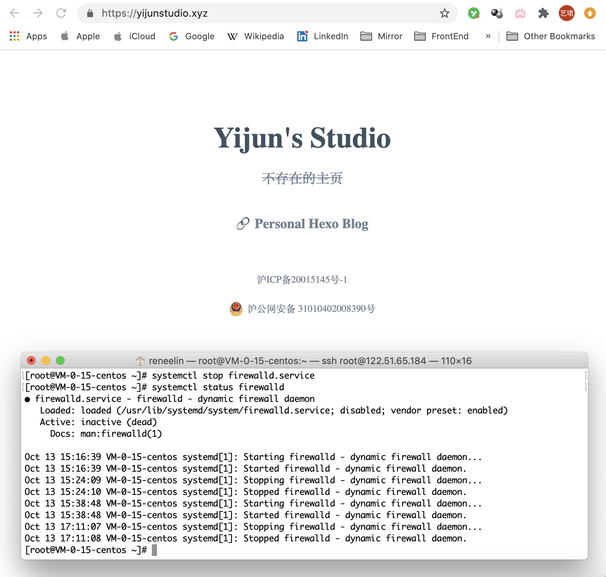
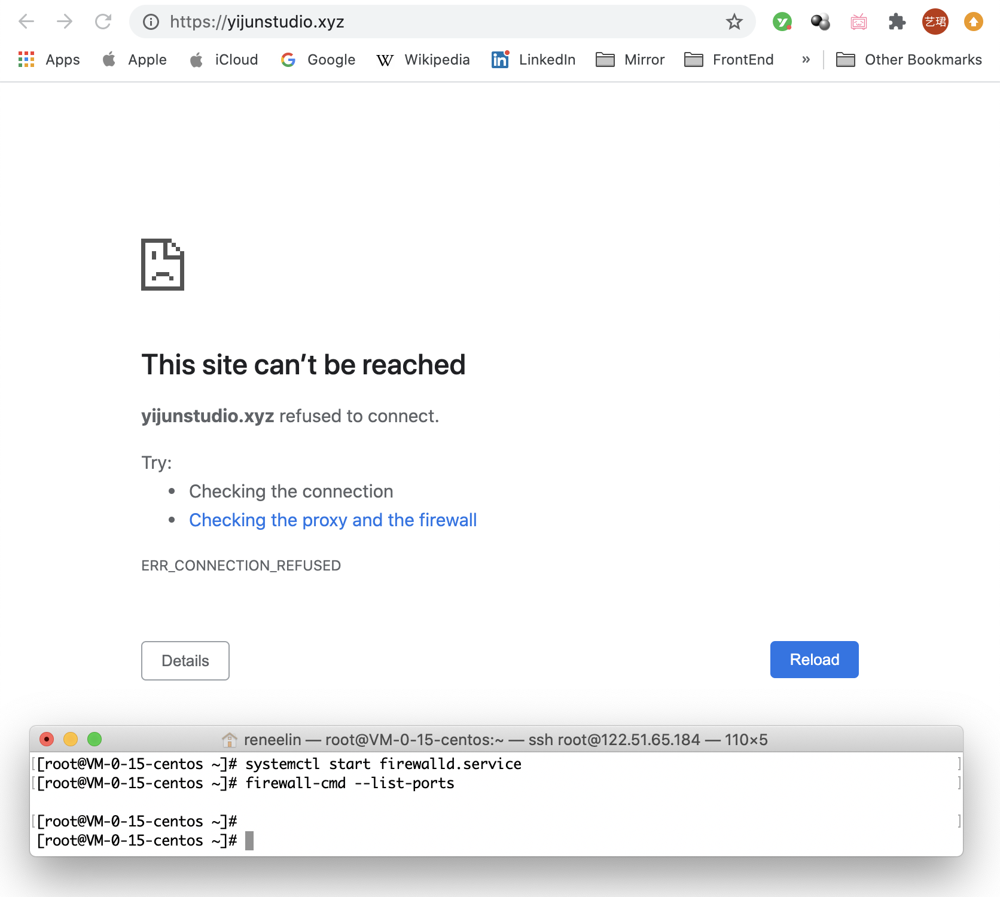
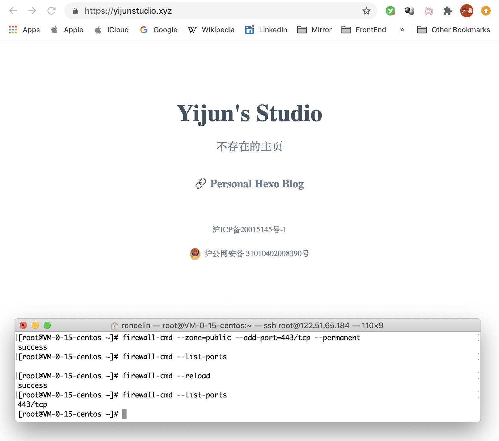
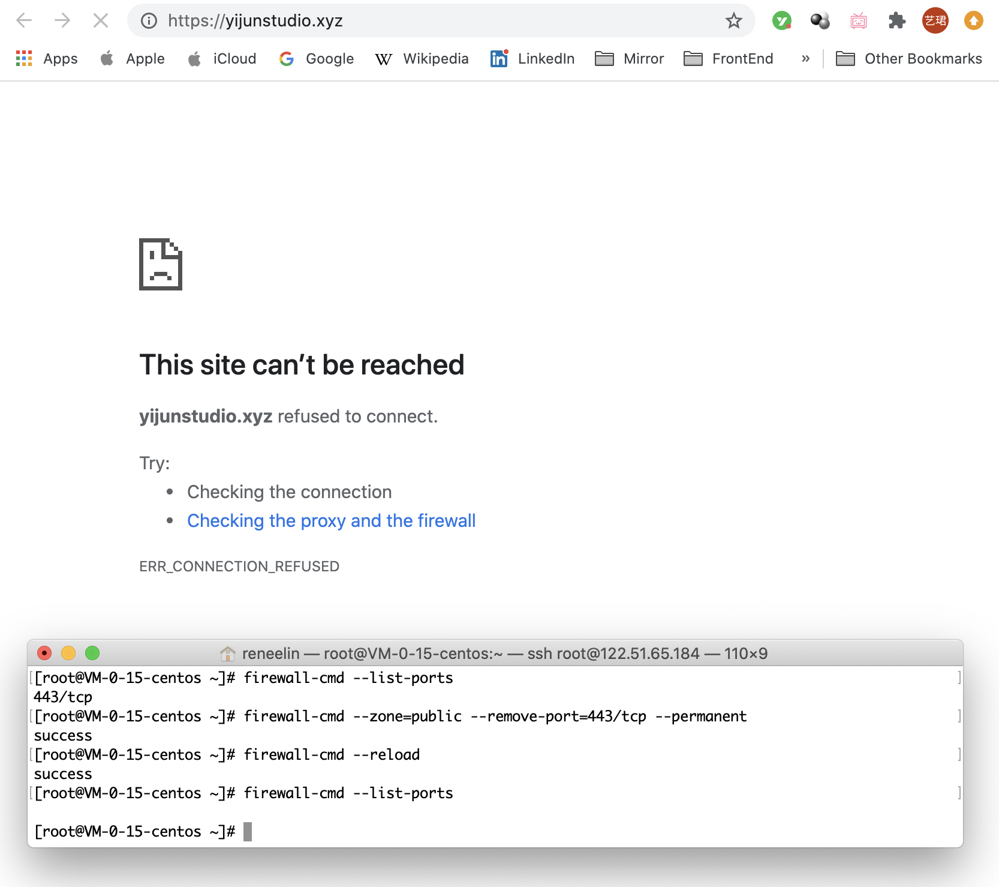
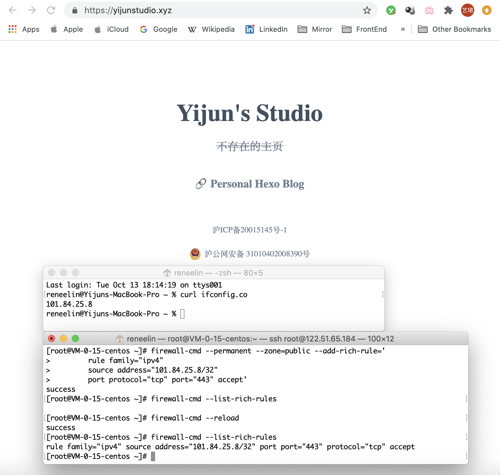
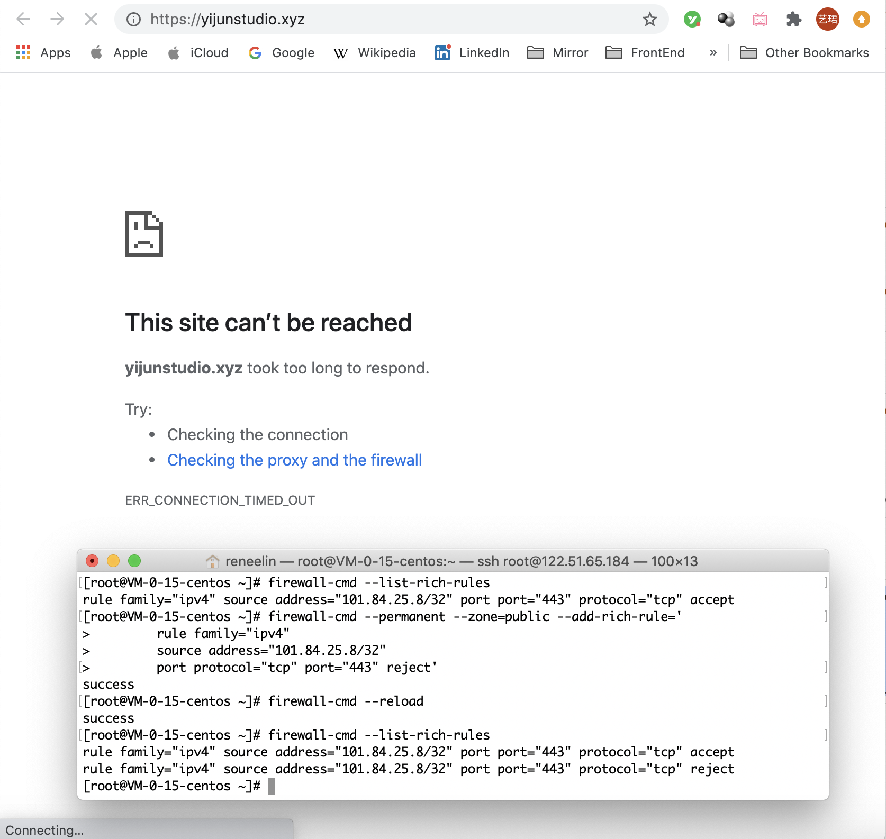
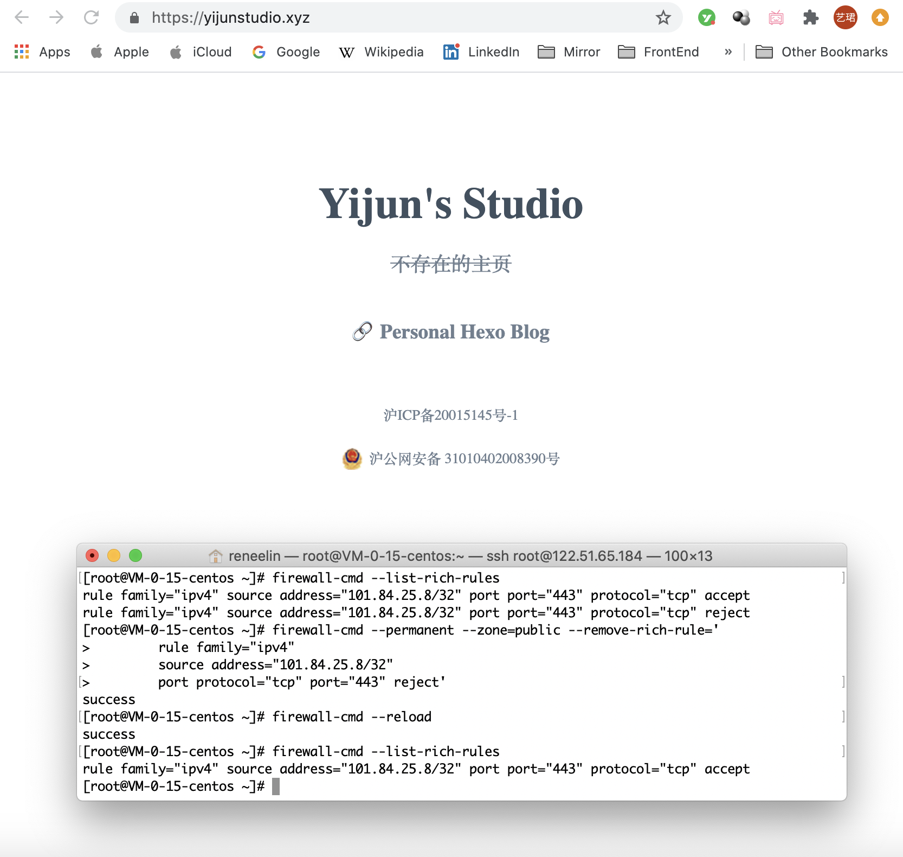
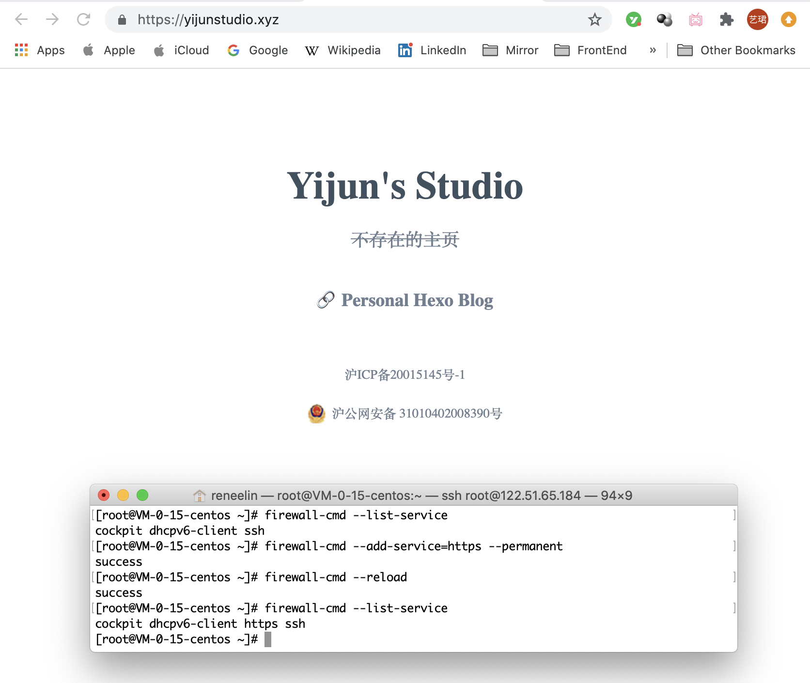

**Created Date**: 2020-10-13 16:25:32
**Last Upgraded Date**: 2020-10-14 12:21:42

<br/>


# 操作环境

>自用腾讯云服务器
>
>CentOS Linux release 8.0.1905 (Core) 
>
>FirewallD 0.6.3

# 准备工作

## 了解FirewallD命令使用方法

```shell
[root@VM-0-15-centos /]# firewall-cmd -h
[root@VM-0-15-centos /]# firewall-cmd --help
```

全部使用方法见本文末尾。

## 查看firewalld状态

```shell
[root@VM-0-15-centos /]# systemctl status firewalld

● firewalld.service - firewalld - dynamic firewall daemon
   Loaded: loaded (/usr/lib/systemd/system/firewalld.service; disabled; vendor preset: enabled)
   Active: inactive (dead)
     Docs: man:firewalld(1)
```

服务器默认不开启firewalld防火墙。此时如果使用firewall-cmd将会提示：“FirewallD is not running”。

## 开启或关闭firewalld

```shell
[root@VM-0-15-centos /]# systemctl start firewalld.service
[root@VM-0-15-centos /]# systemctl stop firewalld.service
```

开启后重新获取firewalld状态，将输出如下信息。

```shell
● firewalld.service - firewalld - dynamic firewall daemon
   Loaded: loaded (/usr/lib/systemd/system/firewalld.service; disabled; vendor preset: enabled)
   Active: active (running) since Tue 2020-10-13 15:16:39 CST; 2min 54s ago
     Docs: man:firewalld(1)
 Main PID: 22908 (firewalld)
    Tasks: 2 (limit: 11538)
   Memory: 24.9M
   CGroup: /system.slice/firewalld.service
           └─22908 /usr/libexec/platform-python -s /usr/sbin/firewalld --nofork --nopid

Oct 13 15:16:39 VM-0-15-centos systemd[1]: Starting firewalld - dynamic firewall daemon...
Oct 13 15:16:39 VM-0-15-centos systemd[1]: Started firewalld - dynamic firewall daemon.
```

## 查看端口情况

```shell
[root@VM-0-15-centos /]# netstat -tunlp
Active Internet connections (only servers)
Proto Recv-Q Send-Q Local Address           Foreign Address         State       PID/Program name    
tcp        0      0 0.0.0.0:21              0.0.0.0:*               LISTEN      21727/vsftpd        
tcp        0      0 0.0.0.0:22              0.0.0.0:*               LISTEN      1149/sshd           
tcp        0      0 0.0.0.0:443             0.0.0.0:*               LISTEN      16906/nginx: master 
tcp        0      0 0.0.0.0:80              0.0.0.0:*               LISTEN      16906/nginx: master 
tcp6       0      0 :::443                  :::*                    LISTEN      16906/nginx: master 
tcp6       0      0 :::9090                 :::*                    LISTEN      1/systemd           
tcp6       0      0 :::3306                 :::*                    LISTEN      31294/mysqld        
tcp6       0      0 :::80                   :::*                    LISTEN      16906/nginx: master 
udp        0      0 172.17.0.15:68          0.0.0.0:*                           791/NetworkManager  
udp        0      0 127.0.0.1:323           0.0.0.0:*                           4422/chronyd        
udp6       0      0 ::1:323                 :::*                                4422/chronyd        
```

# 防火墙配置

## 开放单个端口

关闭防火墙的情况下，即status为inactive时，可以正常访问由nginx配置的443端口，即https访问，如下图。

```shell
[root@VM-0-15-centos ~]# systemctl stop firewalld.service
[root@VM-0-15-centos ~]# systemctl status firewalld
● firewalld.service - firewalld - dynamic firewall daemon
   Loaded: loaded (/usr/lib/systemd/system/firewalld.service; disabled; vendor preset: enabled)
   Active: inactive (dead)
     Docs: man:firewalld(1)

```



打开防火墙，默认没有端口可以被访问，因此进行https访问时被拒绝，如下图。

```shell
[root@VM-0-15-centos ~]# systemctl start firewalld.service
[root@VM-0-15-centos ~]# firewall-cmd --list-ports

```



添加443端口的永久tcp连接。此处永久指重启不失效。

```shell
[root@VM-0-15-centos ~]# firewall-cmd --zone=public --add-port=443/tcp --permanent
success
```

使用--list-ports查看现在的端口，依然没有443/tcp，网页也依然无法访问。因为需要reload配置，激活新添加的端口。

```shell
[root@VM-0-15-centos ~]# firewall-cmd --list-ports

```

reload后，重新查看端口，可以看到已经添加。网页也可以被访问。

```shell
[root@VM-0-15-centos ~]# firewall-cmd --reload
success
[root@VM-0-15-centos ~]# firewall-cmd --list-ports
443/tcp
```



## 对特定ip地址开放特定端口

首先删除之前开放的443端口，网页无法访问。

```shell
[root@VM-0-15-centos ~]# firewall-cmd --zone=public --remove-port=443/tcp --permanent
success
[root@VM-0-15-centos ~]# firewall-cmd --reload
success
```



对10.95.69.248开放443端口。

```shell
[root@VM-0-15-centos ~]# firewall-cmd --permanent --zone=public --add-rich-rule='
        rule family="ipv4"
        source address="101.84.25.8/32"
        port protocol="tcp" port="443" accept'       
success
[root@VM-0-15-centos ~]# firewall-cmd --list-rich-rules

[root@VM-0-15-centos ~]# firewall-cmd --reload
success
[root@VM-0-15-centos ~]# firewall-cmd --list-rich-rules
rule family="ipv4" source address="101.84.25.8/32" port port="443" protocol="tcp" accept
```



再拒绝10.95.69.248对于443端口的请求。

```shell
[root@VM-0-15-centos ~]# firewall-cmd --permanent --zone=public --add-rich-rule='
        rule family="ipv4"
        source address="101.84.25.8/32"
        port protocol="tcp" port="443" reject'    
success
[root@VM-0-15-centos ~]# firewall-cmd --reload
success
[root@VM-0-15-centos ~]# firewall-cmd --list-rich-rules
rule family="ipv4" source address="101.84.25.8/32" port port="443" protocol="tcp" accept
rule family="ipv4" source address="101.84.25.8/32" port port="443" protocol="tcp" reject
```



删除reject规则，可正常访问。

```shell
[root@VM-0-15-centos ~]# firewall-cmd --permanent --zone=public --remove-rich-rule='
        rule family="ipv4"
        source address="101.84.25.8/32"
        port protocol="tcp" port="443" reject'    
        
[root@VM-0-15-centos ~]# firewall-cmd --reload
success
[root@VM-0-15-centos ~]# firewall-cmd --list-rich-rules
rule family="ipv4" source address="101.84.25.8/32" port port="443" protocol="tcp" accept
```



## 开放https服务

查看所有支持的服务。

```shell
[root@VM-0-15-centos ~]# firewall-cmd --get-service
(此处返回很多服务)
```

显示现在已经启动的服务。随后添加https服务，reload后重新查看已启动的服务，网页可以访问。

```shell
[root@VM-0-15-centos ~]# firewall-cmd --list-service
cockpit dhcpv6-client ssh
[root@VM-0-15-centos ~]# firewall-cmd --add-service-https --permanent
success
[root@VM-0-15-centos ~]# firewall-cmd --reload
success
[root@VM-0-15-centos ~]# firewall-cmd --list-service
cockpit dhcpv6-client https ssh
```



# 附录 firewall-cmd -h

```shell
Usage: firewall-cmd [OPTIONS...]

General Options
  -h, --help           Prints a short help text and exists
  -V, --version        Print the version string of firewalld
  -q, --quiet          Do not print status messages

Status Options
  --state              Return and print firewalld state
  --reload             Reload firewall and keep state information
  --complete-reload    Reload firewall and lose state information
  --runtime-to-permanent
                       Create permanent from runtime configuration
  --check-config       Check permanent configuration for errors

Log Denied Options
  --get-log-denied     Print the log denied value
  --set-log-denied=<value>
                       Set log denied value

Automatic Helpers Options
  --get-automatic-helpers
                       Print the automatic helpers value
  --set-automatic-helpers=<value>
                       Set automatic helpers value

Permanent Options
  --permanent          Set an option permanently
                       Usable for options marked with [P]

Zone Options
  --get-default-zone   Print default zone for connections and interfaces
  --set-default-zone=<zone>
                       Set default zone
  --get-active-zones   Print currently active zones
  --get-zones          Print predefined zones [P]
  --get-services       Print predefined services [P]
  --get-icmptypes      Print predefined icmptypes [P]
  --get-zone-of-interface=<interface>
                       Print name of the zone the interface is bound to [P]
  --get-zone-of-source=<source>[/<mask>]|<MAC>|ipset:<ipset>
                       Print name of the zone the source is bound to [P]
  --list-all-zones     List everything added for or enabled in all zones [P]
  --new-zone=<zone>    Add a new zone [P only]
  --new-zone-from-file=<filename> [--name=<zone>]
                       Add a new zone from file with optional name [P only]
  --delete-zone=<zone> Delete an existing zone [P only]
  --load-zone-defaults=<zone>
                       Load zone default settings [P only] [Z]
  --zone=<zone>        Use this zone to set or query options, else default zone
                       Usable for options marked with [Z]
  --get-target         Get the zone target [P only] [Z]
  --set-target=<target>
                       Set the zone target [P only] [Z]
  --info-zone=<zone>   Print information about a zone
  --path-zone=<zone>   Print file path of a zone [P only]

IPSet Options
  --get-ipset-types    Print the supported ipset types
  --new-ipset=<ipset> --type=<ipset type> [--option=<key>[=<value>]]..
                       Add a new ipset [P only]
  --new-ipset-from-file=<filename> [--name=<ipset>]
                       Add a new ipset from file with optional name [P only]
  --delete-ipset=<ipset>
                       Delete an existing ipset [P only]
  --load-ipset-defaults=<ipset>
                       Load ipset default settings [P only]
  --info-ipset=<ipset> Print information about an ipset
  --path-ipset=<ipset> Print file path of an ipset [P only]
  --get-ipsets         Print predefined ipsets
  --ipset=<ipset> --set-description=<description>
                       Set new description to ipset [P only]
  --ipset=<ipset> --get-description
                       Print description for ipset [P only]
  --ipset=<ipset> --set-short=<description>
                       Set new short description to ipset [P only]
  --ipset=<ipset> --get-short
                       Print short description for ipset [P only]
  --ipset=<ipset> --add-entry=<entry>
                       Add a new entry to an ipset [P]
  --ipset=<ipset> --remove-entry=<entry>
                       Remove an entry from an ipset [P]
  --ipset=<ipset> --query-entry=<entry>
                       Return whether ipset has an entry [P]
  --ipset=<ipset> --get-entries
                       List entries of an ipset [P]
  --ipset=<ipset> --add-entries-from-file=<entry>
                       Add a new entries to an ipset [P]
  --ipset=<ipset> --remove-entries-from-file=<entry>
                       Remove entries from an ipset [P]

IcmpType Options
  --new-icmptype=<icmptype>
                       Add a new icmptype [P only]
  --new-icmptype-from-file=<filename> [--name=<icmptype>]
                       Add a new icmptype from file with optional name [P only]
  --delete-icmptype=<icmptype>
                       Delete an existing icmptype [P only]
  --load-icmptype-defaults=<icmptype>
                       Load icmptype default settings [P only]
  --info-icmptype=<icmptype>
                       Print information about an icmptype
  --path-icmptype=<icmptype>
                       Print file path of an icmptype [P only]
  --icmptype=<icmptype> --set-description=<description>
                       Set new description to icmptype [P only]
  --icmptype=<icmptype> --get-description
                       Print description for icmptype [P only]
  --icmptype=<icmptype> --set-short=<description>
                       Set new short description to icmptype [P only]
  --icmptype=<icmptype> --get-short
                       Print short description for icmptype [P only]
  --icmptype=<icmptype> --add-destination=<ipv>
                       Enable destination for ipv in icmptype [P only]
  --icmptype=<icmptype> --remove-destination=<ipv>
                       Disable destination for ipv in icmptype [P only]
  --icmptype=<icmptype> --query-destination=<ipv>
                       Return whether destination ipv is enabled in icmptype [P only]
  --icmptype=<icmptype> --get-destinations
                       List destinations in icmptype [P only]

Service Options
  --new-service=<service>
                       Add a new service [P only]
  --new-service-from-file=<filename> [--name=<service>]
                       Add a new service from file with optional name [P only]
  --delete-service=<service>
                       Delete an existing service [P only]
  --load-service-defaults=<service>
                       Load icmptype default settings [P only]
  --info-service=<service>
                       Print information about a service
  --path-service=<service>
                       Print file path of a service [P only]
  --service=<service> --set-description=<description>
                       Set new description to service [P only]
  --service=<service> --get-description
                       Print description for service [P only]
  --service=<service> --set-short=<description>
                       Set new short description to service [P only]
  --service=<service> --get-short
                       Print short description for service [P only]
  --service=<service> --add-port=<portid>[-<portid>]/<protocol>
                       Add a new port to service [P only]
  --service=<service> --remove-port=<portid>[-<portid>]/<protocol>
                       Remove a port from service [P only]
  --service=<service> --query-port=<portid>[-<portid>]/<protocol>
                       Return whether the port has been added for service [P only]
  --service=<service> --get-ports
                       List ports of service [P only]
  --service=<service> --add-protocol=<protocol>
                       Add a new protocol to service [P only]
  --service=<service> --remove-protocol=<protocol>
                       Remove a protocol from service [P only]
  --service=<service> --query-protocol=<protocol>
                       Return whether the protocol has been added for service [P only]
  --service=<service> --get-protocols
                       List protocols of service [P only]
  --service=<service> --add-source-port=<portid>[-<portid>]/<protocol>
                       Add a new source port to service [P only]
  --service=<service> --remove-source-port=<portid>[-<portid>]/<protocol>
                       Remove a source port from service [P only]
  --service=<service> --query-source-port=<portid>[-<portid>]/<protocol>
                       Return whether the source port has been added for service [P only]
  --service=<service> --get-source-ports
                       List source ports of service [P only]
  --service=<service> --add-module=<module>
                       Add a new module to service [P only]
  --service=<service> --remove-module=<module>
                       Remove a module from service [P only]
  --service=<service> --query-module=<module>
                       Return whether the module has been added for service [P only]
  --service=<service> --get-modules
                       List modules of service [P only]
  --service=<service> --set-destination=<ipv>:<address>[/<mask>]
                       Set destination for ipv to address in service [P only]
  --service=<service> --remove-destination=<ipv>
                       Disable destination for ipv i service [P only]
  --service=<service> --query-destination=<ipv>:<address>[/<mask>]
                       Return whether destination ipv is set for service [P only]
  --service=<service> --get-destinations
                       List destinations in service [P only]

Options to Adapt and Query Zones
  --list-all           List everything added for or enabled in a zone [P] [Z]
  --list-services      List services added for a zone [P] [Z]
  --timeout=<timeval>  Enable an option for timeval time, where timeval is
                       a number followed by one of letters 's' or 'm' or 'h'
                       Usable for options marked with [T]
  --set-description=<description>
                       Set new description to zone [P only] [Z]
  --get-description    Print description for zone [P only] [Z]
  --set-short=<description>
                       Set new short description to zone [P only] [Z]
  --get-short          Print short description for zone [P only] [Z]
  --add-service=<service>
                       Add a service for a zone [P] [Z] [T]
  --remove-service=<service>
                       Remove a service from a zone [P] [Z]
  --query-service=<service>
                       Return whether service has been added for a zone [P] [Z]
  --list-ports         List ports added for a zone [P] [Z]
  --add-port=<portid>[-<portid>]/<protocol>
                       Add the port for a zone [P] [Z] [T]
  --remove-port=<portid>[-<portid>]/<protocol>
                       Remove the port from a zone [P] [Z]
  --query-port=<portid>[-<portid>]/<protocol>
                       Return whether the port has been added for zone [P] [Z]
  --list-protocols     List protocols added for a zone [P] [Z]
  --add-protocol=<protocol>
                       Add the protocol for a zone [P] [Z] [T]
  --remove-protocol=<protocol>
                       Remove the protocol from a zone [P] [Z]
  --query-protocol=<protocol>
                       Return whether the protocol has been added for zone [P] [Z]
  --list-source-ports  List source ports added for a zone [P] [Z]
  --add-source-port=<portid>[-<portid>]/<protocol>
                       Add the source port for a zone [P] [Z] [T]
  --remove-source-port=<portid>[-<portid>]/<protocol>
                       Remove the source port from a zone [P] [Z]
  --query-source-port=<portid>[-<portid>]/<protocol>
                       Return whether the source port has been added for zone [P] [Z]
  --list-icmp-blocks   List Internet ICMP type blocks added for a zone [P] [Z]
  --add-icmp-block=<icmptype>
                       Add an ICMP block for a zone [P] [Z] [T]
  --remove-icmp-block=<icmptype>
                       Remove the ICMP block from a zone [P] [Z]
  --query-icmp-block=<icmptype>
                       Return whether an ICMP block has been added for a zone
                       [P] [Z]
  --add-icmp-block-inversion
                       Enable inversion of icmp blocks for a zone [P] [Z]
  --remove-icmp-block-inversion
                       Disable inversion of icmp blocks for a zone [P] [Z]
  --query-icmp-block-inversion
                       Return whether inversion of icmp blocks has been enabled
                       for a zone [P] [Z]
  --list-forward-ports List IPv4 forward ports added for a zone [P] [Z]
  --add-forward-port=port=<portid>[-<portid>]:proto=<protocol>[:toport=<portid>[-<portid>]][:toaddr=<address>[/<mask>]]
                       Add the IPv4 forward port for a zone [P] [Z] [T]
  --remove-forward-port=port=<portid>[-<portid>]:proto=<protocol>[:toport=<portid>[-<portid>]][:toaddr=<address>[/<mask>]]
                       Remove the IPv4 forward port from a zone [P] [Z]
  --query-forward-port=port=<portid>[-<portid>]:proto=<protocol>[:toport=<portid>[-<portid>]][:toaddr=<address>[/<mask>]]
                       Return whether the IPv4 forward port has been added for
                       a zone [P] [Z]
  --add-masquerade     Enable IPv4 masquerade for a zone [P] [Z] [T]
  --remove-masquerade  Disable IPv4 masquerade for a zone [P] [Z]
  --query-masquerade   Return whether IPv4 masquerading has been enabled for a
                       zone [P] [Z]
  --list-rich-rules    List rich language rules added for a zone [P] [Z]
  --add-rich-rule=<rule>
                       Add rich language rule 'rule' for a zone [P] [Z] [T]
  --remove-rich-rule=<rule>
                       Remove rich language rule 'rule' from a zone [P] [Z]
  --query-rich-rule=<rule>
                       Return whether a rich language rule 'rule' has been
                       added for a zone [P] [Z]

Options to Handle Bindings of Interfaces
  --list-interfaces    List interfaces that are bound to a zone [P] [Z]
  --add-interface=<interface>
                       Bind the <interface> to a zone [P] [Z]
  --change-interface=<interface>
                       Change zone the <interface> is bound to [Z]
  --query-interface=<interface>
                       Query whether <interface> is bound to a zone [P] [Z]
  --remove-interface=<interface>
                       Remove binding of <interface> from a zone [P] [Z]

Options to Handle Bindings of Sources
  --list-sources       List sources that are bound to a zone [P] [Z]
  --add-source=<source>[/<mask>]|<MAC>|ipset:<ipset>
                       Bind the source to a zone [P] [Z]
  --change-source=<source>[/<mask>]|<MAC>|ipset:<ipset>
                       Change zone the source is bound to [Z]
  --query-source=<source>[/<mask>]|<MAC>|ipset:<ipset>
                       Query whether the source is bound to a zone [P] [Z]
  --remove-source=<source>[/<mask>]|<MAC>|ipset:<ipset>
                       Remove binding of the source from a zone [P] [Z]

Helper Options
  --new-helper=<helper> --module=<module> [--family=<family>]
                       Add a new helper [P only]
  --new-helper-from-file=<filename> [--name=<helper>]
                       Add a new helper from file with optional name [P only]
  --delete-helper=<helper>
                       Delete an existing helper [P only]
  --load-helper-defaults=<helper>
                       Load helper default settings [P only]
  --info-helper=<helper> Print information about an helper
  --path-helper=<helper> Print file path of an helper [P only]
  --get-helpers         Print predefined helpers
  --helper=<helper> --set-description=<description>
                       Set new description to helper [P only]
  --helper=<helper> --get-description
                       Print description for helper [P only]
  --helper=<helper> --set-short=<description>
                       Set new short description to helper [P only]
  --helper=<helper> --get-short
                       Print short description for helper [P only]
  --helper=<helper> --add-port=<portid>[-<portid>]/<protocol>
                       Add a new port to helper [P only]
  --helper=<helper> --remove-port=<portid>[-<portid>]/<protocol>
                       Remove a port from helper [P only]
  --helper=<helper> --query-port=<portid>[-<portid>]/<protocol>
                       Return whether the port has been added for helper [P only]
  --helper=<helper> --get-ports
                       List ports of helper [P only]
  --helper=<helper> --set-module=<module>
                       Set module to helper [P only]
  --helper=<helper> --get-module
                       Get module from helper [P only]
  --helper=<helper> --set-family={ipv4|ipv6|}
                       Set family for helper [P only]
  --helper=<helper> --get-family
                       Get module from helper [P only]

Direct Options
  --direct             First option for all direct options
  --get-all-chains
                       Get all chains [P]
  --get-chains {ipv4|ipv6|eb} <table>
                       Get all chains added to the table [P]
  --add-chain {ipv4|ipv6|eb} <table> <chain>
                       Add a new chain to the table [P]
  --remove-chain {ipv4|ipv6|eb} <table> <chain>
                       Remove the chain from the table [P]
  --query-chain {ipv4|ipv6|eb} <table> <chain>
                       Return whether the chain has been added to the table [P]
  --get-all-rules
                       Get all rules [P]
  --get-rules {ipv4|ipv6|eb} <table> <chain>
                       Get all rules added to chain in table [P]
  --add-rule {ipv4|ipv6|eb} <table> <chain> <priority> <arg>...
                       Add rule to chain in table [P]
  --remove-rule {ipv4|ipv6|eb} <table> <chain> <priority> <arg>...
                       Remove rule with priority from chain in table [P]
  --remove-rules {ipv4|ipv6|eb} <table> <chain>
                       Remove rules from chain in table [P]
  --query-rule {ipv4|ipv6|eb} <table> <chain> <priority> <arg>...
                       Return whether a rule with priority has been added to
                       chain in table [P]
  --passthrough {ipv4|ipv6|eb} <arg>...
                       Pass a command through (untracked by firewalld)
  --get-all-passthroughs
                       Get all tracked passthrough rules [P]
  --get-passthroughs {ipv4|ipv6|eb} <arg>...
                       Get tracked passthrough rules [P]
  --add-passthrough {ipv4|ipv6|eb} <arg>...
                       Add a new tracked passthrough rule [P]
  --remove-passthrough {ipv4|ipv6|eb} <arg>...
                       Remove a tracked passthrough rule [P]
  --query-passthrough {ipv4|ipv6|eb} <arg>...
                       Return whether the tracked passthrough rule has been
                       added [P]

Lockdown Options
  --lockdown-on        Enable lockdown.
  --lockdown-off       Disable lockdown.
  --query-lockdown     Query whether lockdown is enabled

Lockdown Whitelist Options
  --list-lockdown-whitelist-commands
                       List all command lines that are on the whitelist [P]
  --add-lockdown-whitelist-command=<command>
                       Add the command to the whitelist [P]
  --remove-lockdown-whitelist-command=<command>
                       Remove the command from the whitelist [P]
  --query-lockdown-whitelist-command=<command>
                       Query whether the command is on the whitelist [P]
  --list-lockdown-whitelist-contexts
                       List all contexts that are on the whitelist [P]
  --add-lockdown-whitelist-context=<context>
                       Add the context context to the whitelist [P]
  --remove-lockdown-whitelist-context=<context>
                       Remove the context from the whitelist [P]
  --query-lockdown-whitelist-context=<context>
                       Query whether the context is on the whitelist [P]
  --list-lockdown-whitelist-uids
                       List all user ids that are on the whitelist [P]
  --add-lockdown-whitelist-uid=<uid>
                       Add the user id uid to the whitelist [P]
  --remove-lockdown-whitelist-uid=<uid>
                       Remove the user id uid from the whitelist [P]
  --query-lockdown-whitelist-uid=<uid>
                       Query whether the user id uid is on the whitelist [P]
  --list-lockdown-whitelist-users
                       List all user names that are on the whitelist [P]
  --add-lockdown-whitelist-user=<user>
                       Add the user name user to the whitelist [P]
  --remove-lockdown-whitelist-user=<user>
                       Remove the user name user from the whitelist [P]
  --query-lockdown-whitelist-user=<user>
                       Query whether the user name user is on the whitelist [P]

Panic Options
  --panic-on           Enable panic mode
  --panic-off          Disable panic mode
  --query-panic        Query whether panic mode is enabled
```

